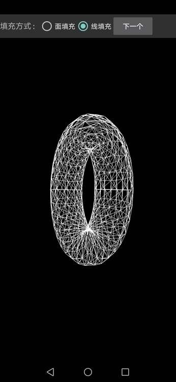
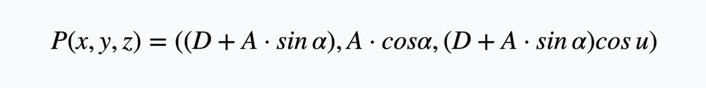

# 3DGraphicPlaygroud

## 圆柱体绘制
### 顶点绘制

### 贴图

### 运行效果
[图片]

## 圆锥体绘制
### 顶点绘制

### 贴图

### 运行效果
[图片]

## 圆环
### 运行效果
 

### 顶点计算公式

- $$\alpha$$ : 小圆的角度
- A : 小圆的半径 
- u : 大圆的夹角  
- D : 大圆的半径

### 法向量计算(代办)

## 螺旋管
### 运行效果
[图片]

### 顶点计算公式
和圆环类似，只是会在边缘顶点生成的时候逐渐增加y坐标

## 几何球体
### 顶点绘制
几何球体和普通球体最大的不同就在于纹理排布
- 普通球体根据类似地球经纬度的方式排布顶点，纹理会有比较强烈的拉升
- 普通球体纹理能完整显示，集合球体纹理无法完全显示, 尽量合理调整
- 几何球体是由正十二面体作为原型, 将每一条弧切割成`n`份，最终绘制而成
  - 每条弧上的点的位置的计算公式在代码中有所说明：  

### 纹理绘制
- 几何球体的纹理绘制是将几何球体的`正20面三角`形平铺在平面上后来绘制的。

